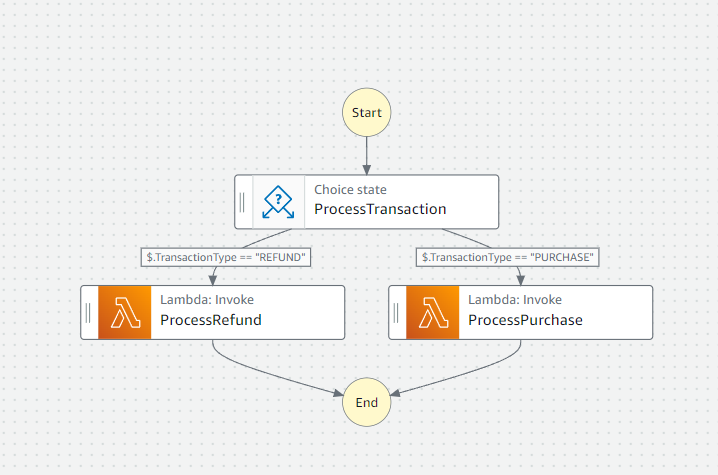

prereqs : lambda funcs are created and a statemachine has the defintion created w. below specs.
undestanding ASL lesson 1. how to if else.
{
    "Comment" : "Transaction Process State Machine",
    "StartAt" : "ProcessTransaction",
    "States" : {
        "ProcessTransaction":{
            "Type" : "Choice",
            "Choices": [ -> i can think of choices as synonomous with IF/ELSE statements
            as can be seen with the below two bracket blocks
                
                {
                    "Variable": "$.TransactionType", -> this is the input that is accepted by state function. it is a variable and will JSON.
                    in this case the input to be passed in is 
                    {"TransactionType"  "PURCHASE"} keyt value paor
                    
                    "StringEquals": "PURCHASE",
                    "Next": "ProcessPurchase" -> the flow will move to this stage
                },
                {
                    "Variable": "$.TransactionType",
                    "StringEquals" : "REFUND",
                    "Next" : "ProcessRefund"
                }
            ]
        },

        below two are lambdas that state function points too. needs IAM role onvoke lambda to trigger them.
        "ProcessRefund": {
            "Type": "Task", -> several types of 
            "Resource": "arn:aws:lambda:eu-west-2:390746273208:function:ProcessRefund",
            "End": true
        },
        "ProcessPurchase":{
            "Type" : "Task",
            "Resource" : "arn:aws:lambda:eu-west-2:390746273208:function:ProcessPurchase",
            "End": true
        }
    }
}

the above asl translates to this

important to note that stages are entered with a given input that is JSON.
for example given the  {"TransactionType"  "REFUND"}
the state will pass to the function arn Process refund.
{
  "output": {
    "TransactionType": "REFUND",
    "Timestamp": "2024-08-04 16-17-42",
    "Message": "hello from lamdba , we inside the processRefund funciton"
  },
  "outputDetails": {
    "truncated": false
  }
}

